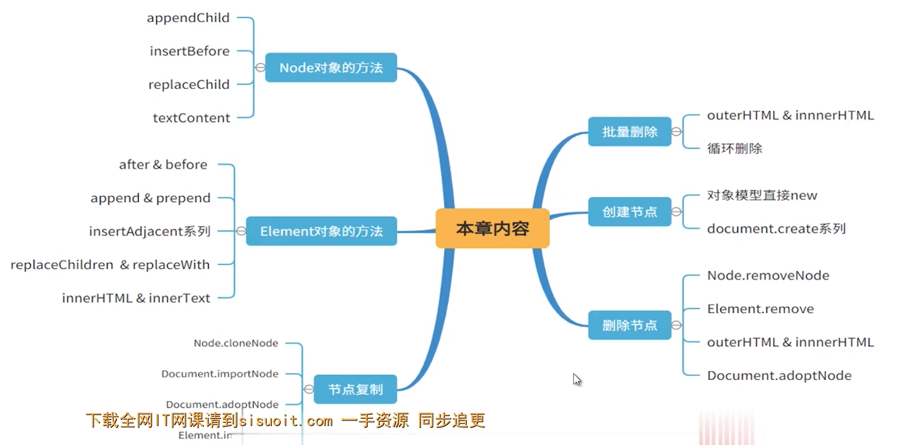

### 手写查看继承关系的方法

```
function getParents(el) {
    if (typeof el !== "object" || el === null) {
        throw new Error("el应该是一个对象")
    }
    var _el = el;
    var result = [];
    while (_el.__proto__ !== null) {
        result.push(_el.__proto__.constructor.name);
        _el = _el.__proto__;
    }
    return result;
}
```

### 相关 API



### 内存泄漏

- 全局作用域
- console.log
- 闭包
- eval node
