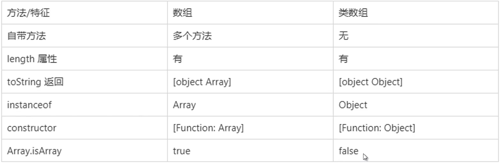

### 创建数组的方式

- 数组对象字面量
- new Array
- Array.from(ES6)
- Array.of(ES6)
- Array.prototype.slice, Array.prototype.concat 等

### 类数组

- 是有一个 length 属性和从零开始索引的属性，但是没有 Array 的内置方法，比如 forEach()和 map()等特殊对象

### 常见的类数组

- arguments
- DOM 相关：NodeList 等

### 类数组转为数组的方法

- slice, concat
- Array.from
- Array.apply
- 复制遍历

### 总结

