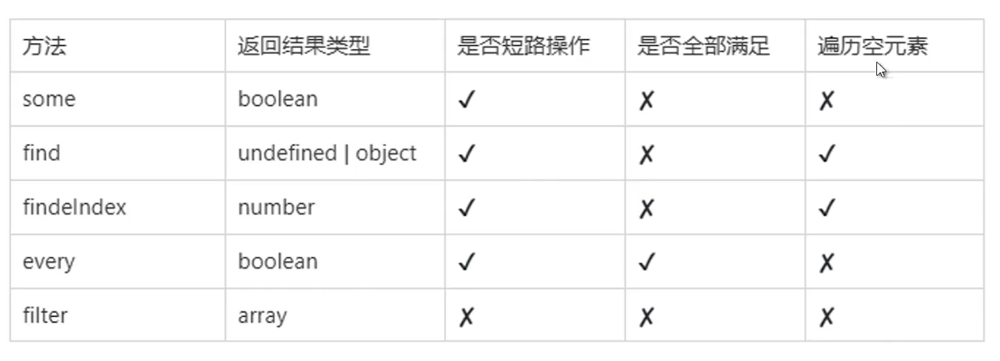

### 数组空元素 empty

- empty：数组的空位，指数组的某一位置没有任何值。简单来说，就是数组上没有对应的属性。
- 一般的遍历，自动跳过空位，forEach，reduce 等
- 基于值进行运算，空位的值作为 undefined

### 稀疏数组

- 有空元素的数组，就是稀疏数组

### 数组查找或者过滤



### 改变自身的方法

- pop,shift,splice
- unshift,push,sort,reverse
- ES6:copyWithin,fill

### sort 注意事项

- 默认按照 ASSII 码先后顺序排序

```
const array=[1,2,3,4,5,6,7,8,9,10];
array.sort();
console.log("array sort:",array);// array sort: [1, 10, 2, 3, 4, 5,  6, 7, 8, 9]

console.log("10:".charCodeAt()); //49
console.log("1:".charCodeAt()); //49
```
